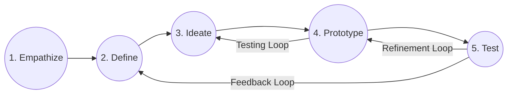

# IDEA GENERATION AND PRODUCT INNOVATION LAB RECORD
## MUFFAKHAM COLLEGE OF ENGINEERING AND TECHNOLOGY
### DEPARTMENT OF MECHANICAL ENGINEERING

**Course Code:** PC453ME  
**Academic Year:** 2025-2026  
**Semester:** B.E – IV Semester  

---

### Student Details
*   **Student Name:** [Your Name]
*   **Roll Number:** [Your Roll Number]
*   **Department:** Mechanical Engineering

---

### Certificate

This is to certify that **[Your Name]** of **B.E – IV Semester** of the **Mechanical Engineering Department** has successfully completed the laboratory work for the **Idea Generation and Product Innovation Laboratory** during the academic year **2025-2026**.

 

**Faculty Signature:** ____________________ &nbsp;&nbsp;&nbsp;&nbsp;&nbsp;&nbsp;&nbsp;&nbsp;&nbsp;&nbsp;&nbsp;&nbsp;&nbsp;&nbsp;&nbsp;&nbsp;&nbsp;&nbsp;&nbsp;&nbsp; **HOD Signature:** ____________________

---

### Index

| Week | Topic / Lab Exercise | Lab Document | Status |
| :---: | :--- | :---: | :---: |
| **1** | Introduction to Design Thinking & Solar Efficiency Research | [Week 01 README](file:///C:/Users/User/Desktop/agy/lab_record/Week01_Intro/README.md) | Completed |
| **2** | Define Phase – POV & Problem Statement | [Week 02 README](file:///C:/Users/User/Desktop/agy/lab_record/Week02_Define/README.md) | Completed |
| **3** | Ideation Techniques I — Brainstorming & SCAMPER | [Week 03 README](file:///C:/Users/User/Desktop/agy/lab_record/Week03_Ideation_I/README.md) | Completed |
| **4** | Ideation Techniques II — Concept Evaluation & Selection | [Week 04 README](file:///C:/Users/User/Desktop/agy/lab_record/Week04_Ideation_II/README.md) | Completed |
| **5** | Prototyping I – Low-Fidelity Prototyping & Storyboarding | [Week 05 README](file:///C:/Users/User/Desktop/agy/lab_record/Week05_Prototyping_I/README.md) | Completed |
| **6** | Prototyping II – CAD Modeling & Assembly | [Week 06 README](file:///C:/Users/User/Desktop/agy/lab_record/Week06_Prototyping_II/README.md) | Completed |
| **7** | Prototyping III – 3D Printing & Fabrication Log | [Week 07 README](file:///C:/Users/User/Desktop/agy/lab_record/Week07_Prototyping_III/README.md) | Completed |
| **8** | Testing Phase — Performance Testing & Failure Analysis | [Week 08 README](file:///C:/Users/User/Desktop/agy/lab_record/Week08_Testing/README.md) | Completed |
| **9** | Iteration & Redesign — Design Optimizations | [Week 09 README](file:///C:/Users/User/Desktop/agy/lab_record/Week09_Iteration/README.md) | Completed |
| **10** | Engineering Validation — Calculations & Stress Analysis | [Week 10 README](file:///C:/Users/User/Desktop/agy/lab_record/Week10_Validation/README.md) | Completed |
| **11** | Communication & Documentation — Report & User Manual | [Week 11 README](file:///C:/Users/User/Desktop/agy/lab_record/Week11_Communication/README.md) | Completed |
| **12** | Pitching and Final Preparation — Slide Deck & Q&A Prep | [Week 12 README](file:///C:/Users/User/Desktop/agy/lab_record/Week12_Pitching/README.md) | Completed |
| **13** | Final Presentation & Demo Day — Showcase & Reflection | [Week 13 README](file:///C:/Users/User/Desktop/agy/lab_record/Week13_Final/README.md) | Completed |

---

### Introduction to Design Thinking

Design thinking is a human-centered, iterative problem-solving framework. It consists of five core stages: Empathize with users, Define their core problems, Ideate creative solutions, Prototype rough representations, and Test them in the real world. It is a flexible, non-linear approach that embraces continuous learning and refinement.

#### 1. Empathize
Understand the people one is designing for by setting aside assumptions.
*   **Goal:** Discover genuine human needs, frustrations, and motivations.
*   **Actions:** Conduct user interviews, observe behaviors in their natural environment, and compile user feedback.

#### 2. Define
Synthesize the research to establish a core problem statement.
*   **Goal:** Frame the problem in a human-centric way, keeping the user's specific needs at the center.
*   **Actions:** Create user personas, craft "How Might We" (HMW) statements, and outline pain points.

#### 3. Ideate
Challenge assumptions and explore a wide range of possibilities.
*   **Goal:** Generate as many diverse, creative solutions as possible before narrowing them down.
*   **Actions:** Run brainstorming sessions, mind mapping, and SCAMPER analysis.

#### 4. Prototype
Turn the best ideas into tangible, low-cost representations.
*   **Goal:** Build to think. Prototypes allow designers to investigate how solutions perform and expose potential flaws early.
*   **Actions:** Create paper sketches, low-fidelity physical mockups, storyboard interactions, and CAD models.

#### 5. Test
Put the prototypes in front of users and test environments to evaluate their effectiveness.
*   **Goal:** Validate the solutions, gather actionable feedback, and analyze failure modes to iterate.
*   **Actions:** Conduct performance tests, record output voltages, run engineering validation studies, and optimize code/mechanisms.
