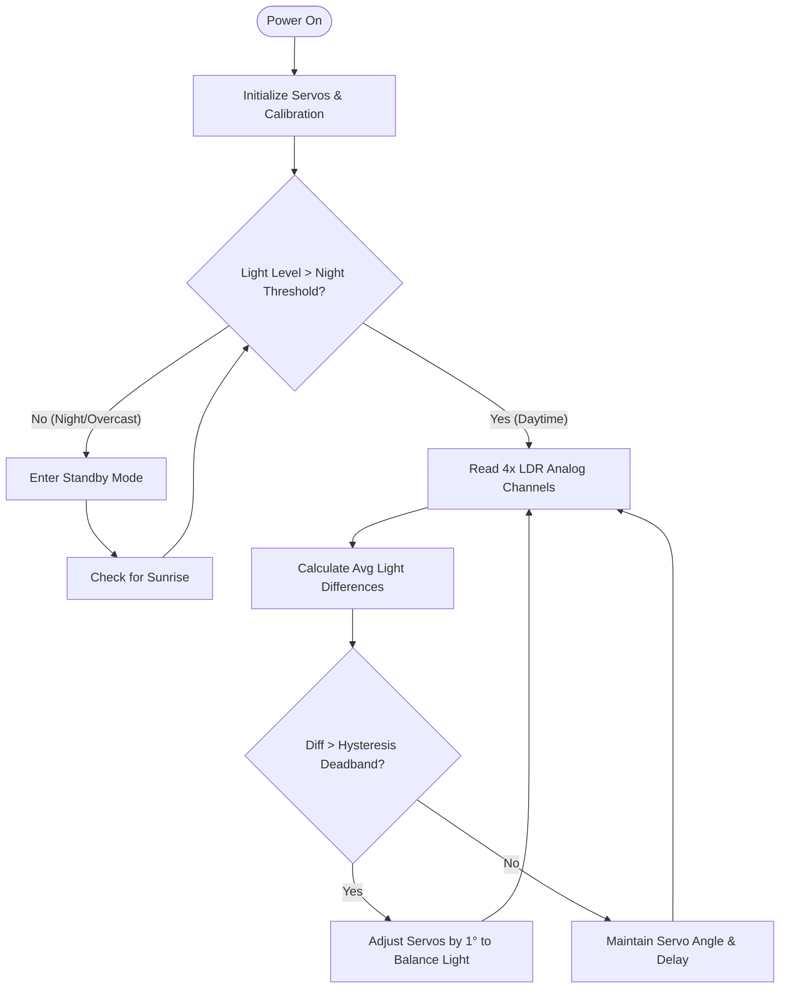

# ☀️ Helio-Track S1: Dual-Axis Solar Tracking System

[](https://typst.app)
[](https://arduino.cc)
[](https://www.solidworks.com/)
[](LICENSE)
[](https://mjcollege.ac.in)

This repository contains the complete laboratory record and design documentation for **Helio-Track S1**, an affordable, 3D-printable dual-axis solar tracking system. Developed as part of the **Idea Generation and Product Innovation Lab (PC453ME)** in the Department of Mechanical Engineering at **Muffakham College of Engineering and Technology (MCET)**.

The entire report is typeset programmatically using [Typst](https://typst.app), utilizing [Fletcher](https://github.com/fennecdextra/fletcher) for system flowcharts and [CeTZ](https://github.com/johannes-mueller/cetz) for vector-drawn engineering schematics.

---

## 🛠️ Project Overview: Helio-Track S1

The **Helio-Track S1** is a closed-loop dual-axis solar tracking system designed to optimize the efficiency of solar panels by keeping them perpendicular to the sun's rays throughout the day and across seasons. By adjusting both the **Azimuth (East-West)** and **Elevation (Altitude)** angles, the system increases solar energy harvest by **up to 38-40%** compared to traditional fixed-tilt mounts.

### 📐 Technical Specifications

| Parameter | Specification | Detail |
| :--- | :--- | :--- |
| **Microcontroller** | Arduino Nano (ATmega328P) | 8-bit RISC, low power, compact footprint |
| **Sensors** | 4x Light Dependent Resistors (LDRs) | Arranged in a quad-quadrant baffle configuration |
| **Actuators** | 2x MG995 High-Torque Servos | Metal gears, 10 kg·cm torque at 6V |
| **Degrees of Freedom** | 2 (Azimuth & Elevation) | Azimuth: 180° range, Elevation: 0°–75° range |
| **Frame Material** | PLA & PETG (3D Printed) | PLA for structural pillar; PETG for stress brackets |
| **Control Logic** | Non-blocking Hysteresis Loop | Prevents servo jitter; automated dark/night sleep mode |
| **Cost** | $< \$50$ USD | Highly accessible for low-income agricultural/off-grid setups |

---

## 🧠 System Control Logic

The system utilizes a quad-LDR sensor array separated by a cross-shaped divider. By comparing light intensity values between top/bottom (for elevation) and left/right (for azimuth) quadrants, the microcontroller drives the respective servo motors until the light difference falls within a dead-band threshold.



---

## 📂 Repository Structure

The project directory is structured as follows:

```bash
lab_record/
├── .git/                      # Git repository history and configuration
├── README.md                  # This landing documentation file
├── main.typ                   # Master Typst document (Cover, Certificate, TOC)
├── template.typ               # Global style configurations and functions
├── main.pdf                   # Compiled print-ready laboratory report
├── Week01_Intro/              # Introduction and solar configuration research
│   └── week01.typ
├── Week02_Define/             # Define Phase – POV & Problem Statement
│   └── week02.typ
├── Week03_Ideation_I/         # Brainstorming & SCAMPER (Mind Map diagram)
│   └── week03.typ
├── Week04_Ideation_II/        # Concept Evaluation and Selection matrix
│   └── week04.typ
├── Week05_Prototyping_I/      # Low-Fidelity Prototyping & Storyboarding
│   └── week05.typ
├── Week06_Prototyping_II/     # CAD Modeling & Assembly drawings
│   └── week06.typ
├── Week07_Prototyping_III/    # 3D Printing logs and parameters
│   └── week07.typ
├── Week08_Testing/            # Performance testing & solar generation log
│   └── week08.typ
├── Week09_Iteration/          # Redesign and mechanical optimization details
│   └── week09.typ
├── Week10_Validation/         # Engineering calculations (CeTZ schematic diagram)
│   └── week10.typ
├── Week11_Communication/      # Technical report drafting & user manual
│   └── week11.typ
├── Week12_Pitching/           # Final slide deck preparation and Q&A prep
│   └── week12.typ
└── Week13_Final/              # Final demo day reflections & feedback
    └── week13.typ
```

---

## 📜 Laboratory Index & Source Files

Each week corresponds to a specific phase of the Design Thinking process. Click on the links to inspect the source Typst files for each exercise:

| Week | Lab Exercise & Topic | Typst Source File | Design Thinking Phase |
| :---: | :--- | :---: | :---: |
| **1** | Introduction to Design Thinking & Solar Configurations | [week01.typ](Week01_Intro/week01.typ) | **Empathize** |
| **2** | Define Phase – POV & Problem Statement | [week02.typ](Week02_Define/week02.typ) | **Define** |
| **3** | Ideation Techniques I — Brainstorming & SCAMPER | [week03.typ](Week03_Ideation_I/week03.typ) | **Ideate** |
| **4** | Ideation Techniques II — Concept Selection | [week04.typ](Week04_Ideation_II/week04.typ) | **Ideate** |
| **5** | Prototyping I – Low-Fidelity Prototyping & Storyboarding | [week05.typ](Week05_Prototyping_I/week05.typ) | **Prototype** |
| **6** | Prototyping II – CAD Modeling & Assembly | [week06.typ](Week06_Prototyping_II/week06.typ) | **Prototype** |
| **7** | Prototyping III – 3D Printing & Fabrication Log | [week07.typ](Week07_Prototyping_III/week07.typ) | **Prototype** |
| **8** | Testing Phase — Performance Testing & Failure Analysis | [week08.typ](Week08_Testing/week08.typ) | **Test** |
| **9** | Iteration & Redesign — Design Optimizations | [week09.typ](Week09_Iteration/week09.typ) | **Iteration** |
| **10** | Engineering Validation — Calculations & Stress Analysis | [week10.typ](Week10_Validation/week10.typ) | **Validation** |
| **11** | Communication & Documentation — Report & User Manual | [week11.typ](Week11_Communication/week11.typ) | **Documentation** |
| **12** | Pitching and Final Preparation — Slide Deck & Q&A Prep | [week12.typ](Week12_Pitching/week12.typ) | **Pitch** |
| **13** | Final Presentation & Demo Day — Showcase & Reflection | [week13.typ](Week13_Final/week13.typ) | **Reflection** |

---

## 🚀 Compiling the Lab Record PDF

The lab record is compiled from the source files using the modern markdown-like typesetting system, **Typst**.

### Prerequisites
Make sure you have [Typst](https://github.com/typst/typst) installed. You can install it via:
* **Windows (winget):** `winget install Typst.Typst`
* **macOS (Homebrew):** `brew install typst`
* **Linux (Cargo):** `cargo install typst-cli`

### Compilation Commands
Navigate to the root directory `lab_record` in your terminal and run:

1. **One-time compile:**
   ```bash
   typst compile main.typ
   ```
   This will generate a clean, print-ready `main.pdf` in the same directory.

2. **Live preview compile (Watch mode):**
   ```bash
   typst watch main.typ
   ```
   This watches all linked weekly source files and recompiles the PDF instantly whenever changes are saved.

> [!NOTE]
> The compiler will automatically download the correct package versions for `@preview/cetz:0.5.2` and `@preview/fletcher:0.5.8` on the first run. No manual package installation is required.

---

## 👤 Author Information
* **Name:** Murtaza Ahmed
* **Roll Number:** `1607-24-736-XXX` *(Replace with actual roll number if compiling for submission)*
* **Department:** Department of Mechanical Engineering
* **College:** Muffakham College of Engineering and Technology (MCET)
