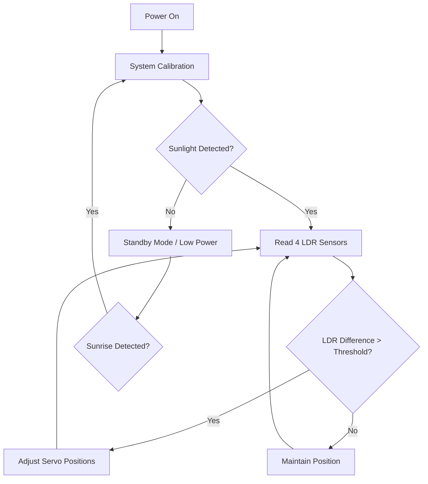

# Week 05: Prototyping I – Low Fidelity & User Interaction

## Aim
To develop a low-fidelity physical prototype and storyboard user interaction to study initial system behavior, layout, and user workflow.

## Materials Required
*   Cardboard sheets
*   Foam board
*   Glue, tape, and hot glue gun
*   Precision cutter and scissors
*   Marker pens
*   Wooden skewers (to represent pivot shafts)

---

## Activities

### 1. Low-Fidelity Physical Prototype
We constructed a quick 1:1 cardboard mockup of the Direct Servo Pillar design:
*   Used a cardboard box base to represent the control enclosure.
*   Rolled a cardboard tube to act as the main pillar.
*   Cut a foam board rectangle to represent the solar panel.
*   Manually turned the joints to simulate Azimuth and Elevation movements.

### 2. Storyboard (Steps 1–5)
Our storyboard models the user experience from setup to daily operation:
1.  **Step 1: Setup:** The user places the dual-axis tracker on a flat surface with a clear view of the sky and connects the 5V power supply.
2.  **Step 2: Initialization:** The Arduino microcontroller boots up, performs a self-test by rotating both servos to their 90-degree (center) positions, and waits for stable LDR readings.
3.  **Step 3: Tracking:** As the sun moves, the LDR sensors detect a light differential. If the difference between top/bottom or left/right LDRs exceeds the threshold, the motors increment by 1 degree.
4.  **Step 4: Peak Optimization:** The panel locks into the position where all four LDRs receive equal light intensity, maximizing the voltage output to the battery.
5.  **Step 5: Night Reset:** At sunset (LDR values fall below 10% for 5 minutes), the panel automatically tilts to 0 degrees elevation and rotates back to the East to wait for sunrise.

### 3. User Interaction Flow
The following state diagram maps out the system logic:

### 4. Low-Fidelity Testing Observations
Using the mockup and manual light simulations (flashlight + breadboarded LDR circuit), we observed:
*   **Sensor Shielding:** The LDR sensors easily detected ambient light scattered from the ground, causing false movements. *Fix:* They must be housed in directional wells.
*   **Motor Jitter:** Standard micro-servo code updated too fast, causing the mechanism to shake. *Fix:* Added `delay(50)` and reduced step changes to 1 degree for smooth panning.

---

## Deliverables
1.  **Low-Fidelity Cardboard Model** description and notes.
2.  **Storyboard Sequence** from installation to night reset.
3.  **Mermaid User Interaction Flowchart** (detailed above).

## Outcome
Students understand how to use rapid, low-cost low-fidelity prototypes to identify fundamental software and sensor layout flaws before spending time on CAD or fabrication.
